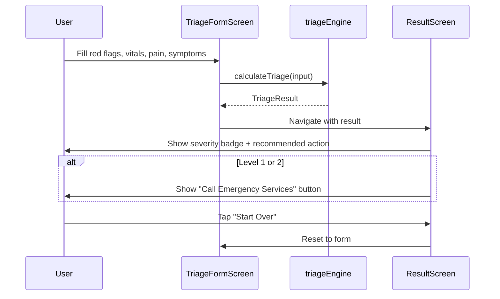

# Technical Requirements Document (TRD)

---
## 1. Overview
This document defines the technical implementation of **HealthAI Triage**, a React Native / Expo mobile application implementing a deterministic, rule-based symptom triage engine. See [[PRD]] for product scope and rationale.

## 2. Tech Stack
| Layer | Choice | Notes |
|---|---|---|
| Framework | ==Expo SDK 51== (React Native 0.74) | Managed workflow, no native code required for MVP |
| Language | ==TypeScript== (strict mode) | Type safety is critical given the safety-relevant scoring logic |
| UI | React Native core components (`View`, `Text`, `TextInput`, `Switch`) | No external UI kit — kept dependency-light for auditability |
| State | Local component state (`useState`) | No global store needed; app is a two-screen linear flow |
| Navigation | Manual screen-state switch in `App.tsx` | React Navigation intentionally omitted for MVP simplicity |

## 3. Project Structure
```
healthai-triage/
├── App.tsx                       # Root component; screen state machine (form → result)
├── app.json                      # Expo app config
├── package.json / tsconfig.json / babel.config.js
├── src/
│   ├── types.ts                  # SeverityLevel enum, TriageInput/Result, RedFlags, Vitals
│   ├── logic/
│   │   └── triageEngine.ts       # calculateTriage(): pure function, the safety-critical core
│   ├── components/
│   │   ├── Disclaimer.tsx        # Persistent non-diagnostic disclaimer banner
│   │   └── SeverityBadge.tsx     # Color-coded severity display
│   └── screens/
│       ├── TriageFormScreen.tsx  # Intake: red flags, vitals, pain, duration, symptoms
│       └── ResultScreen.tsx      # Output: severity badge, action, reasons, emergency call
```

## 4. Data Model
```typescript
enum SeverityLevel { LEVEL_1 = 1, LEVEL_2, LEVEL_3, LEVEL_4, LEVEL_5 }

interface Vitals {
  heartRate?: number;      // bpm
  systolicBP?: number;     // mmHg
  spo2?: number;           // %
  temperatureC?: number;   // °C
  respiratoryRate?: number;// breaths/min
}

interface RedFlags {
  unresponsive: boolean;
  notBreathingOrGasping: boolean;
  strokeSigns: boolean;
  chestPainSevere: boolean;
  uncontrolledBleeding: boolean;
  anaphylaxisSigns: boolean;
  seizureActive: boolean;
}

interface TriageInput {
  ageYears: number;
  painScore: number;             // 0-10
  symptomDurationHours: number;
  vitals: Vitals;
  redFlags: RedFlags;
  otherSymptoms: string[];
}

interface TriageResult {
  level: SeverityLevel;
  label: string;
  color: string;
  recommendedAction: string;
  triggeredReasons: string[];
  isEmergency: boolean;          // true for Level 1 & 2
}
```
All fields except red flags and pain score are optional-tolerant: missing vitals simply skip that check rather than erroring, so the engine degrades gracefully with partial input.

## 5. Triage Engine — Decision Logic
`calculateTriage(input: TriageInput): TriageResult` is a **pure function** evaluated in strict priority order. Each step short-circuits — once a level is determined, no lower-priority checks run:

1. **Red flags** (any true) → Level 1, unconditionally.
2. **Critical vitals** (SpO2 < 90, systolic BP < 90 or > 200, HR < 40 or > 150, RR < 8 or > 30) → Level 1.
3. **Emergent signals** (borderline vitals, high-risk symptom tags, pain ≥ 9) → Level 2.
4. **Urgent signals** (GI/dehydration symptoms, suspected fracture, pain ≥ 6, duration ≥ 48h) → Level 3.
5. **Less urgent** (pain ≥ 3 or any other symptom selected) → Level 4.
6. **Default** → Level 5.

Design constraints on this function:
- Must remain a **pure function** (no side effects, no I/O) so it stays unit-testable in isolation.
- Must **never silently downgrade** severity when inputs conflict — ties always resolve to the more severe level.
- Every returned `TriageResult.triggeredReasons` must map to a concrete condition checked in code — no free-text or inferred explanations.

## 6. Screen Flow


## 7. Non-Functional Requirements
- **Offline-first:** No network calls required for core triage logic — the engine runs entirely on-device.
- **Performance:** `calculateTriage` must execute in constant time (< 1ms); no async operations in the critical path.
- **Accessibility:** All interactive elements (switches, checkboxes, pain-scale buttons) must have adequate touch targets (≥ 40x40) and readable contrast, especially given users may be stressed or in pain while using it.
- **Testability:** `triageEngine.ts` should have unit test coverage for every branch (each red flag individually, each vital threshold boundary, each severity tier) before production use.
- **Localization-ready:** All user-facing strings should be extractable for translation in a future iteration; emergency number must be region-configurable, not hardcoded.

## 8. Out of Scope (MVP)
- Remote data storage or user accounts.
- Any ML/LLM-based symptom interpretation (explicitly rejected in favor of auditable rules — see [[PRD]] §3.2).
- Multi-language support.
- Integration with EHR/EMR systems.

## 9. Pre-Production Checklist
- [ ] Clinical sign-off on all rule thresholds in `triageEngine.ts`.
- [ ] Unit tests covering every branch of `calculateTriage`.
- [ ] Region-specific emergency number configuration.
- [ ] Legal/compliance review of disclaimer language for target jurisdictions.
- [ ] Accessibility audit (screen reader labels currently minimal on custom components).

## See Also
- [[PRD]] — Product scope, audience, and feature rationale
- [[Triage Engine]] — This document's §5, kept in sync with `src/logic/triageEngine.ts`